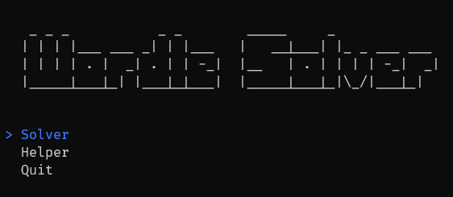
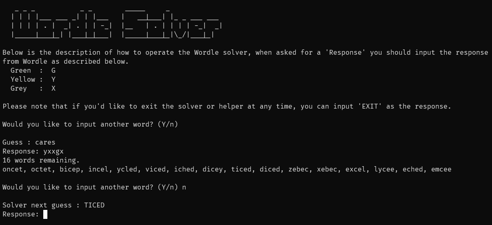
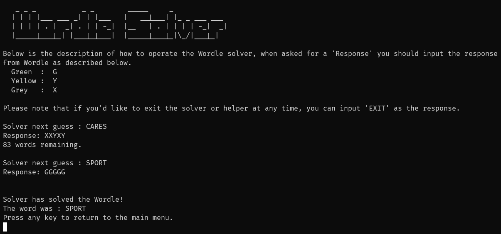

# Wordle Solver

Wordle Solver is a C# program to solve the game 'Wordle', it was completed as my project for the AQA A-Level Computer Science Non-exam assessment (NEA).

It implements a simple MiniMax algorithm to filter through the Wordle word list and provide very accurate guesses, solving Wordle in roughly 4 guesses with a high accuracy.

## Images
**Main menu**: The main menu allows you to select which mode you want to use, the helper or the solver, you can also exit the program from here.

---

**Helper**: The helper will help you with your own Wordle game by not fully solving it but allowing you to ask it to provide a word for you if you're stuck.

---

**Solved**: The solver will solve the Wordle game for you, it will provide you with guesses and you need to give it the responses.

## Compiling
- Requires .NET 5.0

Simply clone the project and run the single application publish on release for it to compile to ``/WordleSolver/bin/release/net5.0/win-x64/publish/WordleSolver.exe``.

You'll also need to include the ``wordlist.txt`` file in the same directory as the executable for it to read from, this word list is simply a line separated list of the internal words used for wordle.